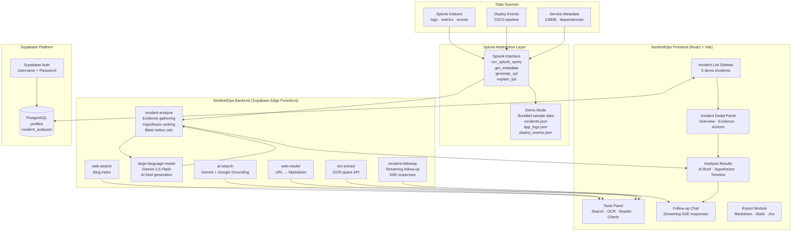

# SentinelOps — Agentic AI Incident Commander for Splunk

> **Splunk Agentic Ops Hackathon 2026 · Observability Track**

SentinelOps transforms noisy Splunk signals into guided incident response. Select an incident, click **Analyze**, and within seconds you get: ranked root-cause hypotheses with confidence scores, blast-radius calculation, a correlated event timeline, and AI-recommended next actions — all powered by live Splunk data via **MCP Server 1.2** or **REST API**, with reasoning provided by Gemini 2.5 Flash or a configurable Splunk Hosted Model.

---

## Quick Start

```bash
# 1. Install dependencies
pnpm install

# 2. Start development server
pnpm dev
```

**Demo login** — `admin` / `S3ntin3l$Ops#Admin2026!`  
Or register a new account directly on the login page.

> No Splunk instance required — Demo Mode ships with five pre-loaded incidents across checkout-service, payment-api, auth-service, inventory-service, and notification-service.

---

## Installation & Configuration

### 1. Environment Variables

Variables are injected automatically by the Supabase + Vite build pipeline. For local development, create `.env.local`:

```env
VITE_SUPABASE_URL=https://<project>.supabase.co
VITE_SUPABASE_ANON_KEY=<anon-key>
```

For judge/CI deployments without a UI, set these Supabase secrets so the edge function can connect without user-entered credentials:

```
SPLUNK_HOST=https://your-splunk-instance:8089
SPLUNK_TOKEN=your-splunk-hec-or-rest-token
SPLUNK_MCP_URL=https://your-ngrok-or-mcp-url
SPLUNK_MCP_TOKEN=your-mcp-bearer-token
```

### 2. Supabase Setup

The project requires the following tables (all created by existing migrations):

| Table | Purpose |
|-------|---------|
| `profiles` | User profiles linked to Supabase Auth |
| `splunk_configs` | Per-user Splunk + MCP + AI + alert settings |
| `live_incidents` | Real-time incident feed (Realtime enabled) |
| `incident_analyses` | Cached AI analysis results per incident |
| `spl_query_history` | Per-user NL→SPL query history |
| `alert_notifications` | Per-user alert notification history |
| `alert_rules` | User-defined alert routing rules |

### 3. Splunk Connection

Three modes — no code changes required, configured entirely from Settings:

| Mode | Header badge | How to enable |
|------|-------------|--------------|
| **Demo** | `DEMO` | Default. No configuration needed. |
| **Splunk REST API** | `LIVE · REST` (blue) | Enter `SPLUNK_HOST` + `SPLUNK_TOKEN` in Settings → Splunk Connection. |
| **Splunk MCP Server 1.2** | `LIVE · MCP` (green) | Enter MCP base URL + bearer token in Settings → Splunk MCP Server. Click **Test MCP Connection**. |

**Priority**: MCP takes precedence over REST when both are configured.

**Ngrok**: Enter your ngrok HTTPS URL (e.g. `https://battered-lukewarm-had.ngrok-free.dev`). SentinelOps auto-appends `/services/mcp`, injects `ngrok-skip-browser-warning: true`, and discovers all tools automatically.

### 4. AI / Reasoning Provider

Configure in Settings → Reasoning Provider. Supported:

| Provider | Notes |
|----------|-------|
| **Gemini 2.5 Flash** | Default — via platform gateway, no key needed for demo |
| **OpenAI GPT-4o** | Paste your `sk-…` key |
| **Anthropic Claude 3.5 Sonnet** | Paste your `sk-ant-…` key |
| **Splunk Hosted Model** | Enter your OpenAI-compatible endpoint URL + token. Used for both streaming and non-streaming analysis. |
| **LLM Fallback Chain** | Ordered list of providers tried on rate-limit or error |

---

## Runtime Architecture

### How Analyze Works

When you click **Analyze**, the frontend POSTs all credentials to the `incident-analyze` edge function, which follows this decision tree:

```
handleAnalyze() → POST /functions/v1/incident-analyze
│
├─ hasMcp && !forceDemoMode
│   ├─ POST {mcpUrl}/services/mcp  (JSON-RPC 2.0, method: "tools/call")
│   │   ├─ OK  → mode: "live-mcp"  → buildLiveEvidence → LLM reasoning
│   │   └─ FAIL → HTTP 502 → frontend shows "live failure" UI + explicit Switch to Demo
│
├─ hasRest && !forceDemoMode   (only when no MCP configured)
│   ├─ POST /services/search/jobs + poll + fetch results
│   │   ├─ OK  → mode: "live-rest" → buildLiveEvidence → LLM reasoning
│   │   └─ FAIL → HTTP 502 → frontend shows "live failure" UI + explicit Switch to Demo
│
└─ else (no credentials OR user clicked "Switch to Demo")
    → mode: "demo" → buildDemoEvidence → LLM reasoning

LLM reasoning:
  Splunk Hosted Model configured:
    streaming:     direct fetch → {endpoint}/chat/completions  ✅
    non-streaming: direct fetch → {endpoint}/chat/completions  ✅
  else:
    callLlm (Gemini gateway / OpenAI / Anthropic)              ✅
```

**Key guarantees:**
- No silent demo fallback on live failure — hard HTTP 502 returned, user must explicitly opt into demo
- `forceDemoMode` only activated when user clicks "Switch to Demo" after a live error
- All 9 credential fields forwarded from frontend: `splunkHost`, `splunkToken`, `mcpUrl`, `mcpToken`, `mcpAuthMethod`, `mcpUsername`, `mcpPassword`, `splunkHostedModelEndpoint`, `splunkHostedModelToken`
- Streaming analysis uses the Splunk Hosted Model endpoint directly (not routed through Gemini gateway)

### MCP 1.2 Wire Format

```json
POST {mcpBase}/services/mcp
{
  "jsonrpc": "2.0",
  "id": 1,
  "method": "tools/call",
  "params": {
    "name": "splunk_run_query",
    "arguments": {
      "query": "index=main service=\"checkout-service\" level=ERROR | stats count by message | sort -count | head 20",
      "earliest_time": "-30m",
      "latest_time": "now",
      "max_results": 50
    }
  }
}
```

Tool candidates tried in order: `splunk_run_query` → `splunk_run_search`.

### Environment Variable Fallback

For judge deployments without UI credential entry:

```ts
const splunkHost  = body.splunkHost  || Deno.env.get("SPLUNK_HOST")      || "";
const splunkToken = body.splunkToken || Deno.env.get("SPLUNK_TOKEN")     || "";
const mcpUrl      = body.mcpUrl      || Deno.env.get("SPLUNK_MCP_URL")   || "";
const mcpToken    = body.mcpToken    || Deno.env.get("SPLUNK_MCP_TOKEN") || "";
```

---

## Feature Overview

### 🧠 AI-Powered Incident Analysis
- **Streaming AI brief** — Executive summary types out in real time
- **Ranked hypotheses** — Up to 5 root causes with confidence scores (0–100%) and supporting evidence
- **Blast radius** — Affected services, endpoints, estimated users impacted, revenue impact estimate
- **Event timeline** — Deployments, alerts, and error bursts correlated chronologically
- **Recommended actions** — Priority-ordered remediation steps
- **Open questions** — Evidence gaps flagged for follow-up

### 📊 Token Budget Control
| Preset | Tokens | Best for |
|--------|--------|---------|
| **Quick** | 2k | Initial on-call triage |
| **Standard** | 8k | Full investigation (default) |
| **Deep Dive** | 16k | Post-mortems, complex multi-service |

### 💾 Auto-Save Draft Recovery
- Partial analysis saved every 30 seconds while streaming
- Draft Recovery Banner on refresh — Restore or Dismiss in one click

### 📤 Export Analysis
- **Markdown** — Full `.md` report with all sections
- **PDF** — Browser print dialog, print-optimised layout

### 🕑 Past Analyses & Side-by-Side Diff
- Full history per incident with data-source badge
- Word-level diff across 11 sections; synchronised scrolling
- Email comparison report via `mailto:` or inline address entry

### 🔌 Splunk MCP Server 1.2 Full Connectivity
- Discovers tools via `initialize` + `tools/list` on Test Connection
- **MCP Tool Explorer** — Interactive cards for all 10 Splunk MCP tools with category filters
- **NL→SPL via MCP** — Generate SPL → edit → execute via `splunk_run_query`
- **E2E Connectivity Test** — 3 SPL assertions + optional 4th hosted-model endpoint probe
- Ngrok auto-detection, bearer + basic auth, URL normalisation

### 🎙️ Voice + NL Command Center (`/command`)
- Streaming AI chat with Gemini 2.5 Flash
- Web Speech API voice input in 10 languages
- AI action cards: resolve, status, query, escalate, scale, notify
- Session-scoped Action Execution History panel

### 🔔 Real-Time Alerts
- Supabase Realtime on `live_incidents` — CRITICAL/HIGH inserts trigger toast + banner
- Notification Center with unread-count badge
- Configurable alert routing rules (severity, service, status → toast/email/webhook/PagerDuty)

### 📈 Enterprise Analytics (`/analytics`)
10+ Recharts visualisations + 6 KPI cards; selective PDF export

### 🔍 Investigation Tools
| Tool | Capability |
|------|-----------|
| Web Search | Bing-indexed search for CVEs, runbooks, known issues |
| AI Search | Gemini + Google grounding — cited, streamed answers |
| OCR Extract | Extract text from log screenshots |
| Web Reader | Fetch any runbook URL as clean Markdown |
| Data Viz | P99 latency + error rate vs deploy events |
| NL→SPL | Natural language → SPL with history, autocomplete, MCP execution |
| Export | Markdown, Slack, Jira, 6-slide PowerPoint |

---

## Architecture

```
Browser (React 18 + Vite + Tailwind + shadcn/ui)
    │
    ├── Supabase Auth  ──────────────────► PostgreSQL (RLS)
    │
    ├── Supabase Realtime ───────────────► live_incidents (INSERT subscription)
    │
    └── Supabase Edge Functions (Deno)
            ├── incident-analyze      ← Core AI orchestration (SSE streaming)
            │                           MCP 1.2 → REST → Demo evidence paths
            │                           Gemini / OpenAI / Anthropic / Splunk Hosted Model
            ├── incident-followup     ← Follow-up chat streaming
            ├── large-language-model  ← Gemini 2.5 Flash proxy
            ├── splunk-mcp            ← MCP Server 1.2 JSON-RPC relay
            ├── splunk-test           ← Connection test (mcp-full + tool-call + auth-debug)
            ├── splunk-mcp-e2e        ← 3 SPL assertions + hosted-model endpoint probe
            ├── ai-search             ← Gemini + Google grounding
            ├── web-search            ← Bing Smart Search
            ├── web-reader            ← URL → Markdown
            └── ocr-extract           ← OCR.space API
```

---

## Pages

| Page | Route | Description |
|------|-------|-------------|
| Login | `/login` | Auth with SentinelOps logo |
| Dashboard | `/` | Three-column triage workspace |
| Analytics | `/analytics` | Enterprise charts + KPIs |
| Command Center | `/command` | Voice + NL AI ops hub |
| Remediation | `/remediation` | Approval workflow + audit trail |
| Settings | `/settings` | Two-column config (Splunk · AI · Integrations · Routing) |

---

## Tech Stack

| Layer | Technology |
|-------|-----------|
| Frontend | React 18 + Vite + TypeScript |
| Styling | Tailwind CSS v3 + shadcn/ui |
| Backend | Supabase Edge Functions (Deno) |
| Database | Supabase PostgreSQL (RLS) |
| Realtime | Supabase Realtime (`postgres_changes`) |
| Auth | Supabase Auth (username + password) |
| AI (default) | Gemini 2.5 Flash (platform gateway) |
| AI (optional) | OpenAI GPT-4o · Anthropic Claude 3.5 · Splunk Hosted Model |
| MCP | Splunk MCP Server 1.2 (Streamable HTTP `/services/mcp`) |
| Diff | `diff` npm package (word-level Myers algorithm) |
| Charts | Recharts |
| Voice | Web Speech API (10 languages) |
| Icons | lucide-react |

---

## Project Structure

```
src/
├── components/
│   ├── incident/
│   │   ├── IncidentDetail.tsx    # Center panel: analysis, export, history, diff
│   │   ├── IncidentList.tsx      # Left sidebar with filters
│   │   ├── AnalysisDiff.tsx      # Side-by-side diff view with email report
│   │   ├── FollowUpPanel.tsx     # Streaming follow-up chat
│   │   └── ToolsPanel.tsx        # 7 investigation tools
│   └── ui/                       # shadcn/ui + custom badge components
├── contexts/
│   ├── LlmContext.tsx            # AI provider config + token budget + cache TTL
│   ├── SplunkContext.tsx         # Splunk + MCP + alert config; isLive/isMcp/isRest/isConfigLoading
│   └── AuthContext.tsx           # Auth state
├── hooks/
│   └── useLiveAlerts.ts          # Realtime subscription + deduplication
├── pages/
│   ├── DashboardPage.tsx         # Main workspace + auto-save draft + Judge Demo mode
│   ├── AnalyticsPage.tsx         # Charts + KPIs
│   ├── CommandCenterPage.tsx     # Voice + NL AI
│   ├── RemediationPage.tsx       # Approval workflow
│   └── SettingsPage.tsx          # Full configuration UI
├── lib/
│   ├── mockDataService.ts        # Demo-mode data (used only when no credentials)
│   └── alertRulesEngine.ts       # Alert rule evaluation
└── types/
    └── types.ts                  # Full TypeScript definitions

supabase/functions/
├── incident-analyze/             # Core AI orchestration (SSE) — MCP/REST/Demo paths
├── incident-followup/            # Streaming follow-up chat
├── large-language-model/         # Gemini 2.5 Flash proxy
├── splunk-mcp/                   # MCP Server 1.2 JSON-RPC relay
├── splunk-test/                  # Connection test + auth debug
├── splunk-mcp-e2e/               # E2E test: 3 SPL assertions + hosted-model probe
├── ai-search/                    # Grounded AI search
├── web-search/                   # Bing Smart Search
├── web-reader/                   # URL content fetcher
└── ocr-extract/                  # OCR.space integration
```

---

## Demo Scenario

A deployment of `checkout-service v1.8.3` at **10:37 UTC** reduces the DB connection pool from 20 → 10 and cuts query timeout from 5000 → 2000ms. By **10:42 UTC**: P99 latency = 3,241ms (baseline 280ms), error rate = 38%, checkout success = 61%.

**SentinelOps in 30 seconds:**
1. Correlates the deployment 5 minutes before incident onset
2. Finds 847 `HikariPool: Timeout waiting for connection` errors
3. Ranks: *Deployment regression (88%)* → *DB pool starvation (74%)* → *Upstream cascade (45%)*
4. Blast radius: checkout → payment-api → inventory (12,400 users, $4,200/min)
5. Recommends: evaluate rollback, restore pool size, restore timeout, page on-call

---

## Hackathon Scoring Notes

| Criterion | Implementation |
|-----------|----------------|
| **Technological Implementation** | Gemini 2.5 Flash + Splunk Hosted Model LLM; SSE streaming; Splunk MCP 1.2 + REST API; 9 edge functions; realtime analysis pipeline |
| **Design** | Dark operational dashboard, 3-column layout, severity/status badging, confidence bars, timeline visualization; LIVE·MCP / LIVE·REST / DEMO header badge |
| **Potential Impact** | Reduces MTTU from 30–60 min to <2 min; SRE force multiplier |
| **Quality of Idea** | Agentic pattern: MCP evidence gathering → hypothesis ranking → blast radius → recommended actions |
| **Best Use of Splunk MCP Server** | Full MCP 1.2 JSON-RPC 2.0 — `splunk_run_query`/`splunk_run_search`, ngrok support, bearer + basic auth, tool discovery, E2E assertion panel |
| **Best Use of Splunk Hosted Models** | Direct OpenAI-compat fetch in both streaming and non-streaming paths; hosted-model endpoint reachability assertion in E2E panel |
| **Best Use of Splunk Developer Tools** | SPL generation, display, explanation; NL→SPL with MCP execution; REST API polling fallback |

---

_SentinelOps · Built for Splunk Agentic Ops Hackathon 2026_

---

## Quick Start

```bash
# 1. Install dependencies
pnpm install

# 2. Start development server
pnpm dev
```

**Demo login** — `admin` / `S3ntin3l$Ops#Admin2026!`  
Or register a new account directly on the login page.

> No Splunk instance required — Demo Mode ships with five pre-loaded incidents across checkout-service, payment-api, auth-service, inventory-service, and notification-service.

---

## Installation & Configuration

### 1. Environment Variables

Variables are injected automatically by the Supabase + Vite build pipeline. For local development, create `.env.local`:

```env
VITE_SUPABASE_URL=https://<project>.supabase.co
VITE_SUPABASE_ANON_KEY=<anon-key>
```

### 2. Supabase Setup

The project requires the following tables (all created by existing migrations):

| Table | Purpose |
|-------|---------|
| `profiles` | User profiles linked to Supabase Auth |
| `splunk_configs` | Per-user Splunk + MCP + AI + alert settings |
| `live_incidents` | Real-time incident feed (Realtime enabled) |
| `incident_analyses` | Cached AI analysis results per incident |
| `spl_query_history` | Per-user NL→SPL query history |
| `alert_notifications` | Per-user alert notification history |
| `alert_rules` | User-defined alert routing rules |

### 3. Splunk Connection (optional)

Three modes — no code changes required, configured entirely from Settings:

| Mode | How to enable |
|------|--------------|
| **Demo** | Default. No configuration needed. |
| **Splunk REST API** | Enter `SPLUNK_HOST` + `SPLUNK_TOKEN` in Settings → Splunk Connection. |
| **Splunk MCP Server 1.2** | Enter base URL (ngrok or direct) + bearer token in Settings → Splunk MCP Server. Click **Test MCP Connection**. |

**Ngrok setup**: Enter your ngrok HTTPS URL (e.g. `https://battered-lukewarm-had.ngrok-free.dev`). SentinelOps auto-appends `/services/mcp`, injects `ngrok-skip-browser-warning: true`, and discovers all tools automatically.

### 4. AI Provider

Configure in Settings → AI Provider. Supported:

- **Gemini 2.5 Flash** (default, via platform gateway — no key needed for demo)
- **OpenAI GPT-4o** — paste your `sk-…` key
- **Anthropic Claude 3.5 Sonnet** — paste your `sk-ant-…` key
- **LLM Fallback Chain** — ordered list of providers tried on rate-limit or error

---

## Feature Overview

### 🧠 AI-Powered Incident Analysis
- **Streaming AI brief** — Executive summary types out in real time as Gemini generates it
- **Ranked hypotheses** — Up to 5 root causes with confidence scores (0–100%) and supporting evidence bullets
- **Blast radius** — Affected services, endpoints, estimated users impacted, revenue impact estimate
- **Event timeline** — Deployments, alerts, and error bursts correlated chronologically
- **Recommended actions** — Priority-ordered remediation steps
- **Open questions** — Gaps in evidence flagged for follow-up investigation

### 📊 Token Budget Control
Three named presets in Settings → AI Analysis Configuration:

| Preset | Tokens | Best for |
|--------|--------|---------|
| **Quick** | 2k | Initial on-call triage, time-pressured assessment |
| **Standard** | 8k | Full investigation — hypotheses, timeline, blast radius (default) |
| **Deep Dive** | 16k | Post-mortems, complex multi-service incidents |

- Custom values (4k / 6k / 12k) available via fine-tune buttons
- Streaming stops gracefully at the budget; partial result is saved and displayed
- Yellow stop-reason banner shows token count and links to Settings to increase

### 💾 Auto-Save Draft Recovery
- Partial analysis saved to `localStorage` every **30 seconds** while streaming
- On page refresh or tab close, re-selecting the same incident shows a **Draft Recovery Banner**
- Banner shows draft age and token count; one-click **Restore** or **Dismiss**
- Draft cleared automatically on successful full analysis completion

### 📤 Export Analysis
From the incident header **Export** dropdown (appears once an analysis exists):

- **Export as Markdown** — Full `.md` report with all sections + incident metadata. Filename: `incident_<ID>_analysis_<timestamp>.md`
- **Export as PDF** — Triggers browser print dialog pre-set to the correct filename. Sidebar, nav, and header hidden via `@media print` CSS.

### 🕑 Past Analyses & Side-by-Side Diff
- **History panel** — Click **History** on any incident to browse all prior analyses, newest first, with timestamp and data-source badge
- **Load historical result** — Click any row to view that analysis in the detail panel
- **Compare two analyses** — Check any two rows, then click **Compare**:
  - Split-pane diff: older (red tint) on left, newer (green tint) on right
  - Word-level diff: added = green highlight, removed = red strikethrough
  - 11 sections diffed: Summary, Findings, Risk, Hypotheses, Actions, Questions, Timeline, Blast Radius, Errors, Deployments
  - Synchronized scrolling between columns
  - Changed-section count badge in toolbar

### 📧 Email Comparison Report
- **Send Report** button in the diff toolbar
- If Alert Email is configured in Settings, `mailto:` opens immediately
- Otherwise an inline email input row appears — enter address and press Enter
- Email body includes both analysis timestamps, data-source modes, and full before/after text for every changed section

### 🔌 Splunk MCP Server 1.2 Full Connectivity
- Discovers all available tools via `initialize` + `tools/list` on Test Connection
- **MCP Tool Explorer** — Interactive cards for all 10 Splunk MCP tools with category filters and inline result display
- **NL→SPL via MCP** — Generate SPL → edit → execute via `splunk_run_query` — all from Settings
- Auto-appends `/services/mcp`, handles ngrok, classifies all error types with actionable hints
- **MCP Status Indicator** — Pulsing dot in dashboard header; hover shows server name + version + tool count

### 🎙️ Voice + NL Command Center (`/command`)
- Streaming AI chat with full conversation history (Gemini 2.5 Flash)
- Web Speech API voice input in **10 languages** (EN-US/UK/IN, ES, FR, DE, JA, ZH, PT-BR, KO)
- AI action cards: **resolve**, **status**, **query**, **escalate**, **scale**, **notify**
- Session-scoped **Action Execution History** panel

### 🔔 Real-Time Alerts
- Supabase Realtime subscription on `live_incidents` — CRITICAL/HIGH inserts trigger toast + dismissible banner
- **Notification Center** — Bell icon with unread-count badge; full alert history with mark-all-read
- Configurable **alert routing rules** — route by severity, service, status; actions: toast, email, webhook, PagerDuty

### 📈 Enterprise Analytics (`/analytics`)
10+ Recharts visualisations + 6 KPI cards:
- 14-day stacked incident trend, severity donut, status donut
- Incidents-by-service bar chart, MTTR-by-service bar chart
- **30-day MTTR trend** line chart (from real resolved incidents)
- SPL query activity area chart, operational readiness radar
- Cumulative incident velocity, Splunk alert severity breakdown
- **Selective PDF export** — checkbox modal selects which sections to print

### 🔍 Investigation Tools
| Tool | Capability |
|------|-----------|
| Web Search | Bing-indexed search for CVEs, runbooks, known issues |
| AI Search | Gemini + Google grounding — cited, streamed answers |
| OCR Extract | Extract text from log screenshots and error images |
| Web Reader | Fetch any runbook URL as clean Markdown |
| Data Viz | P99 latency + error rate charts vs deploy events |
| NL→SPL | Natural language → SPL with history, autocomplete, MCP execution |
| Export | Markdown, Slack-style, Jira-style, 6-slide PowerPoint |

---

## Pages

| Page | Route | Description |
|------|-------|-------------|
| Login | `/login` | Auth with SentinelOps logo |
| Dashboard | `/` | Three-column triage workspace |
| Analytics | `/analytics` | Enterprise charts + KPIs |
| Command Center | `/command` | Voice + NL AI ops hub |
| Remediation | `/remediation` | Approval workflow + audit trail |
| Settings | `/settings` | Two-column config (Splunk · AI · Integrations · Routing) |

---

## Tech Stack

| Layer | Technology |
|-------|-----------|
| Frontend | React 18 + Vite + TypeScript |
| Styling | Tailwind CSS v3 + shadcn/ui |
| Backend | Supabase Edge Functions (Deno) |
| Database | Supabase PostgreSQL (RLS) |
| Realtime | Supabase Realtime (`postgres_changes`) |
| Auth | Supabase Auth (username + password) |
| AI | Gemini 2.5 Flash (platform gateway) |
| MCP | Splunk MCP Server 1.2 (Streamable HTTP `/services/mcp`) |
| Diff | `diff` npm package (word-level Myers algorithm) |
| Charts | Recharts |
| Voice | Web Speech API (10 languages) |
| Icons | lucide-react |

---

## Project Structure

```
src/
├── components/
│   ├── incident/
│   │   ├── IncidentDetail.tsx    # Center panel: analysis, export, history, diff
│   │   ├── IncidentList.tsx      # Left sidebar with filters
│   │   ├── AnalysisDiff.tsx      # Side-by-side diff view with email report
│   │   ├── FollowUpPanel.tsx     # Streaming follow-up chat
│   │   └── ToolsPanel.tsx        # 7 investigation tools
│   └── ui/                       # shadcn/ui + custom badge components
├── contexts/
│   ├── LlmContext.tsx            # AI provider config + token budget + cache TTL
│   ├── SplunkContext.tsx         # Splunk + MCP + alert config
│   └── AuthContext.tsx           # Auth state
├── hooks/
│   └── useLiveAlerts.ts          # Realtime subscription + deduplication
├── pages/
│   ├── DashboardPage.tsx         # Main workspace + auto-save draft logic
│   ├── AnalyticsPage.tsx         # Charts + KPIs
│   ├── CommandCenterPage.tsx     # Voice + NL AI
│   ├── RemediationPage.tsx       # Approval workflow
│   └── SettingsPage.tsx          # Full configuration UI
├── lib/
│   ├── mockDataService.ts        # Splunk abstraction layer (demo mode)
│   └── alertRulesEngine.ts       # Alert rule evaluation
└── types/
    └── types.ts                  # Full TypeScript definitions

supabase/functions/
├── incident-analyze/             # Core AI orchestration (SSE)
├── incident-followup/            # Streaming follow-up
├── large-language-model/         # Gemini proxy
├── splunk-mcp/                   # MCP Server 1.2 relay
├── splunk-test/                  # Connection test
├── ai-search/                    # Grounded AI search
├── web-search/                   # Bing
├── web-reader/                   # URL fetcher
└── ocr-extract/                  # OCR.space
```

---

## Demo Scenario

A deployment of `checkout-service v1.8.3` at **10:37 UTC** reduces the DB connection pool from 20 → 10 and cuts query timeout from 5000 → 2000ms. By **10:42 UTC**: P99 latency = 3,241ms (baseline 280ms), error rate = 38%, checkout success = 61%.

**SentinelOps in 30 seconds:**
1. Correlates the deployment 5 minutes before incident onset
2. Finds 847 `HikariPool: Timeout waiting for connection` errors
3. Ranks: *Deployment regression (88%)* → *DB pool starvation (74%)* → *Upstream cascade (45%)*
4. Blast radius: checkout → payment-api → inventory (12,400 users, $4,200/min)
5. Recommends: evaluate rollback, restore pool size, restore timeout, page on-call

---

_SentinelOps · Built for Splunk Agentic Ops Hackathon 2026_


> **Hackathon Entry**: Splunk Agentic Ops Hackathon 2026 · Observability Track

SentinelOps transforms noisy Splunk signals into guided incident response briefs. Given an incident, it autonomously gathers evidence from Splunk indexes, correlates deployment events, and generates an AI-powered response brief with ranked hypotheses, blast radius, and recommended next actions — all in seconds.

---

## Architecture



## Demo Scenario

**The Scenario**: A deployment of `checkout-service v1.8.3` at **10:37 UTC** reduces the database connection pool from 20 to 10 and cuts query timeout from 5000ms to 2000ms. By **10:42 UTC**, P99 latency spikes to 3241ms (baseline 280ms), error rate rises to 38%, and checkout success rate drops to 61%.

**SentinelOps Response**:
1. Correlates the deployment at 10:37 — 5 minutes before incident onset
2. Identifies 847 `HikariPool: Timeout waiting for connection` errors
3. Ranks hypotheses: *Deployment regression (88% confidence)* → *DB pool starvation (74%)* → *Upstream cascade (45%)*
4. Calculates blast radius: checkout-service → payment-api → inventory-service (12,400 users, $4,200/min)
5. Recommends: evaluate rollback, restore pool size, restore timeout, page on-call

---

## Features

### 🆕 Splunk MCP Full Connectivity (v43.0.0)
- **Remote MCP Endpoint Support** — Connect SentinelOps to any Splunk MCP Server 1.2 instance over HTTPS using JSON-RPC 2.0 Streamable HTTP transport.
- **Server Discovery** — `initialize` + `tools/list` run automatically on Test Connection. Discovered server name, version, and full tool list are displayed in Settings and persisted to the database.
- **MCP Tool Explorer** — Collapsible panel exposing all 10 Splunk MCP tools as interactive cards. Each card shows: name, description, category badge, editable JSON args, and a Run button with inline result display. Category filter pills: Search · Server · Indexes · Users · Metadata · KV Store · Knowledge · Saved Searches.
- **NL→SPL via MCP** — Two-step workflow: (1) generate SPL from plain English → (2) review/edit → (3) execute via `splunk_run_query` MCP tool. Results shown inline in Settings.
- **Ngrok Skip-Warning Toggle** — Manual toggle in Settings forces `ngrok-skip-browser-warning: true` header on all MCP requests. Auto-detected when URL contains "ngrok"; can be overridden.
- **URL Auto-Normalisation** — Entering a bare ngrok base URL automatically appends `/services/mcp`. Handles `/mcp`, `/messages`, trailing-slash variants.
- **MCP Status Indicator** — Dashboard header shows a `[MCP ●]` badge with green pulsing dot when connected, grey when not configured. Hover tooltip shows server name, version, and tool count.
- **Full Error Classification** — 401/403 (bad token), 404/405 (wrong endpoint), timeout/network errors, and missing bearer token each return specific, actionable error messages with troubleshooting hints.

### 🆕 MCP 1.2 + Command Center Enhancements (v42.0.0)
- **Splunk MCP 1.2 Full Compliance** — Endpoint updated to `/services/mcp` (Streamable HTTP transport), tool name corrected to `splunk_run_query`, arguments aligned to Splunk 1.2 schema
- **Ngrok Splunk Support** — Automatic `ngrok-skip-browser-warning: true` header injection for ngrok-exposed Splunk instances; Settings shows ngrok-specific URL guidance
- **`scale` Action Type** — Command Center AI can now suggest horizontal scaling actions with risk analysis, rendered as orange TrendingUp action cards
- **`notify` Action Type** — Command Center AI can suggest team notification drafts with violet Bell action cards
- **Voice Language Selector** — 10-language voice input support (EN-US/UK/IN, ES, FR, DE, JA, ZH, PT-BR, KO) via dropdown in the Command Center input bar
- **Action Execution History Panel** — Slide-in panel showing every AI-suggested action executed in the session: type badge, service/target metadata, timestamp, count badge, clear-all

### 🆕 Enterprise Enhancements (v35 / v13)
- **Enterprise Analytics Page** — `/analytics` route with 10+ Recharts visualisations: 14-day stacked incident trend, severity & status donuts, incidents-by-service horizontal bar, MTTR-by-service, SPL query activity area chart, Splunk alert severity donut, operational readiness radar, cumulative velocity line chart
- **30-Day MTTR Trend** — Full-width rolling line chart on the Analytics page showing daily average resolution time
- **Analytics KPI Dashboard** — Six live KPI cards (Total Incidents, Open, Critical, Avg MTTR, Splunk Alerts, SPL Queries) with trend badges
- **Scheduled Auto-run for Query History** — Interval selector (Off / 1 min / 5 min / 15 min / 30 min) with live countdown and last-run timestamp
- **SentinelOps Brand Logo** — Official logo on Login page, Dashboard header, Settings header, and empty-state hero
- **Splunk Import Severity Breakdown** — Dialog after successful import shows CRITICAL / HIGH / MEDIUM / LOW counts
- **Webhook Delivery Log CSV Export** — Download the full log as `webhook-delivery-log.csv`
- **Settings Two-Column Layout** — Full-width `lg:grid-cols-2` grid

### Core Incident Analysis
- **Demo incidents** across checkout-service (CRITICAL), payment-api (HIGH), auth-service (MEDIUM), inventory-service (HIGH), notification-service (LOW)
- **AI brief generation** via Gemini 2.5 Flash with executive summary, technical findings, risk statement
- **Ranked root-cause hypotheses** with confidence scores and supporting evidence bullets
- **Blast radius calculation** with affected services, endpoints, user count, revenue impact estimate
- **Event timeline** correlating deployments, alerts, and error bursts chronologically
- **Recommended actions** with priority ordering

### Splunk Integration Abstraction
Implements the Splunk MCP Server 1.2 capability pattern:
- `splunk_run_query(query, earliest_time, latest_time, max_results)` — Execute SPL via MCP (primary)
- `splunk_run_search(search, earliest_time, latest_time, max_count)` — Execute SPL via MCP (fallback)
- `splunk_get_indexes()` — List all Splunk indexes
- `splunk_get_index_info(index)` — Inspect a specific index
- `splunk_get_info()` — Server info and Splunk version
- `splunk_get_user_list()` — List all Splunk users
- `splunk_get_user_info(username)` — Inspect a specific user
- `splunk_get_metadata(index, type)` — Get sourcetypes, sources, or hosts for an index
- `splunk_get_kv_store_collections(app)` — List KV store collections
- `splunk_get_knowledge_objects(object_type, app)` — Browse saved searches, lookups, etc.
- `splunk_run_saved_search(saved_search_name)` — Execute a saved search by name
- `run_splunk_query(query, timeWindow)` — Legacy REST API compatible interface
- `get_metadata(entityType)` — Service metadata, dependencies, SLA targets
- `generate_spl(question)` — Natural language → SPL query generation
- `explain_spl(query)` — Human-readable SPL explanation
- **Splunk Alert Import** — Pull saved alerts from Splunk REST API with severity classification

> **Local Splunk + ngrok setup**: Enter your ngrok HTTPS URL in Settings → Splunk MCP Server (e.g. `https://battered-lukewarm-had.ngrok-free.dev`). SentinelOps auto-appends `/services/mcp`, adds the ngrok skip-warning header, and discovers all available tools automatically.

### Voice & NL Command Center
- Streaming AI chat with Gemini 2.5 Flash — full conversation history context
- Browser Web Speech API voice input with **10-language selector**
- Action cards: **resolve**, **status**, **query**, **escalate**, **scale**, **notify**
- **Action execution history panel** — tracks every AI-suggested action executed this session
- Quick command chips for common operations

### Investigation Tools
| Tool | Capability |
|------|-----------|
| Web Search | Bing-indexed search for CVEs, runbooks, known issues |
| AI Search | Gemini 2.5 Flash + Google grounding for intelligent Q&A |
| OCR Extract | Extract text from log screenshots and error images |
| Web Reader | Fetch runbooks and documentation as Markdown |
| Data Viz | P99 latency + error rate charts correlated with deploy events |
| NL→SPL | Natural language to SPL with history, autocomplete, and MCP execution |
| Command Center | Voice + NL AI commands with scale/notify/escalate/resolve actions |
| Export | Markdown report, Slack-style update, Jira-style summary, PowerPoint |
| Analytics | Full enterprise analytics page with 11+ charts and KPI cards |

---

## Pages & Navigation

| Page | Route | Description |
|------|-------|-------------|
| Login | `/login` | Authentication with SentinelOps logo |
| Dashboard | `/` | Three-column incident triage workspace |
| Analytics | `/analytics` | Enterprise charts, KPIs, and telemetry |
| Command Center | `/command` | Voice + NL AI operations hub |
| Remediation | `/remediation` | Approval workflow with audit trail |
| Settings | `/settings` | Two-column configuration (Splunk, AI, Integrations, Routing) |

---

## Tech Stack

| Layer | Technology |
|-------|-----------|
| Frontend | React 18 + Vite + TypeScript |
| Styling | Tailwind CSS + shadcn/ui |
| Backend | Supabase Edge Functions (Deno) |
| Database | Supabase PostgreSQL |
| Auth | Supabase Auth (username + password) |
| AI Model | Gemini 2.5 Flash (via platform gateway) |
| MCP Protocol | Splunk MCP Server 1.2 (Streamable HTTP, `/services/mcp`) |
| Search | Bing Smart Search API |
| OCR | OCR.space API |
| Charts | Recharts |
| Voice | Web Speech API (10 languages) |

---

## Quick Start

```bash
# Install dependencies
pnpm install

# Start development server
pnpm dev
```

**Demo credentials**: `admin` / `S3ntin3l$Ops#Admin2026!`

Or register a new account directly on the login page.

---

## Splunk Integration Story

SentinelOps is designed to work with **Splunk's full toolchain**:

### Current (Demo Mode)
Uses bundled sample data files (`src/data/`) through the `mockDataService.ts` abstraction layer. All primary flows work without any Splunk connection.

### Splunk REST API Mode
Set `SPLUNK_HOST` + `SPLUNK_TOKEN` in Settings → the abstraction layer routes queries to the Splunk REST API, returning real log data.

### Splunk MCP Server Mode (v43 — Full Tool Connectivity)
SentinelOps implements the **Splunk MCP Server 1.2** specification with complete tool support:

**Connection flow:**
1. Enter your Splunk base URL or ngrok HTTPS URL in Settings → Splunk MCP Server
2. Enter your bearer token (or basic auth credentials)
3. Click **Test MCP Connection** — SentinelOps runs `initialize` + `tools/list`
4. Server name, version, and all available tools appear instantly
5. Click **Save Configuration** — everything persists to the database

**Supported operations:**
| Tool | Purpose |
|------|---------|
| `splunk_run_query` | Run SPL search queries (primary) |
| `splunk_get_indexes` | List all available indexes |
| `splunk_get_index_info` | Inspect a specific index |
| `splunk_get_info` | Server and version info |
| `splunk_get_user_list` | List Splunk users |
| `splunk_get_user_info` | Inspect a specific user |
| `splunk_get_metadata` | Get sourcetypes/sources/hosts |
| `splunk_get_kv_store_collections` | Browse KV store |
| `splunk_get_knowledge_objects` | List saved searches/lookups |
| `splunk_run_saved_search` | Execute saved searches by name |

**Transport:**
- **Endpoint**: `POST {base_url}/services/mcp` (auto-appended)
- **Protocol**: JSON-RPC 2.0 Streamable HTTP
- **Auth**: Bearer token or Basic auth
- **Ngrok**: `ngrok-skip-browser-warning: true` auto-injected when URL contains "ngrok" (overrideable)
- **HTTPS only** — plain HTTP connections are rejected

### Splunk Hosted Models
The `large-language-model` and `incident-followup` edge functions use the platform gateway pattern, pre-configured for Splunk Hosted Model compatibility via `X-Gateway-Authorization` header.

---

## Project Structure

```
src/
├── components/
│   ├── incident/
│   │   ├── IncidentList.tsx      # Left sidebar with incident cards
│   │   ├── IncidentDetail.tsx    # Center panel — overview + analysis results
│   │   ├── FollowUpPanel.tsx     # Streaming follow-up chat
│   │   └── ToolsPanel.tsx        # 6 investigation tools
│   └── ui/
│       └── badges.tsx            # SeverityBadge, StatusBadge, ConfidenceBar
├── data/                         # Sample Splunk-mock data files
│   ├── incidents.json
│   ├── deploy_events.json
│   ├── alerts.json
│   ├── app_logs.json
│   └── metadata.json
├── lib/
│   ├── mockDataService.ts        # Splunk abstraction layer (demo mode)
│   └── sse.ts                    # SSE streaming utilities
├── pages/
│   ├── LoginPage.tsx
│   └── DashboardPage.tsx
└── types/
    └── types.ts                  # Full TypeScript type definitions

supabase/functions/
├── incident-analyze/             # Core AI orchestration
├── incident-followup/            # Streaming follow-up
├── large-language-model/         # Gemini 2.5 Flash proxy
├── ai-search/                    # Gemini + Google grounding
├── web-search/                   # Bing Smart Search
├── web-reader/                   # URL content fetcher
└── ocr-extract/                  # OCR.space integration
```

---

## Hackathon Scoring Notes

| Criterion | Implementation |
|-----------|----------------|
| **Technological Implementation** | Gemini 2.5 Flash LLM, SSE streaming, Splunk MCP pattern, 7 edge functions, real-time analysis pipeline |
| **Design** | Dark operational dashboard, 3-column layout, severity/status badging, confidence bars, timeline visualization |
| **Potential Impact** | Reduces MTTU from 30–60min to <2min; SRE force multiplier for production incidents |
| **Quality of Idea** | Agentic pattern: evidence gathering → hypothesis ranking → blast radius → recommended actions; directly mirrors Splunk observability workflows |
| **Best Use of Splunk MCP Server** | Abstraction layer implements exact MCP Server interface: `run_splunk_query`, `get_metadata`, `generate_spl`, `explain_spl` |
| **Best Use of Splunk Hosted Models** | Gateway-compatible LLM edge functions with `X-Gateway-Authorization` pattern |
| **Best Use of Splunk Developer Tools** | SPL query generation, display, and explanation built into analysis flow |

---

_SentinelOps · Built for Splunk Agentic Ops Hackathon 2026_
