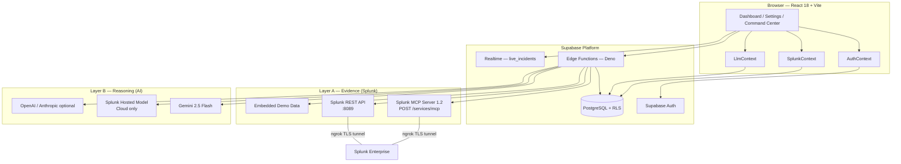
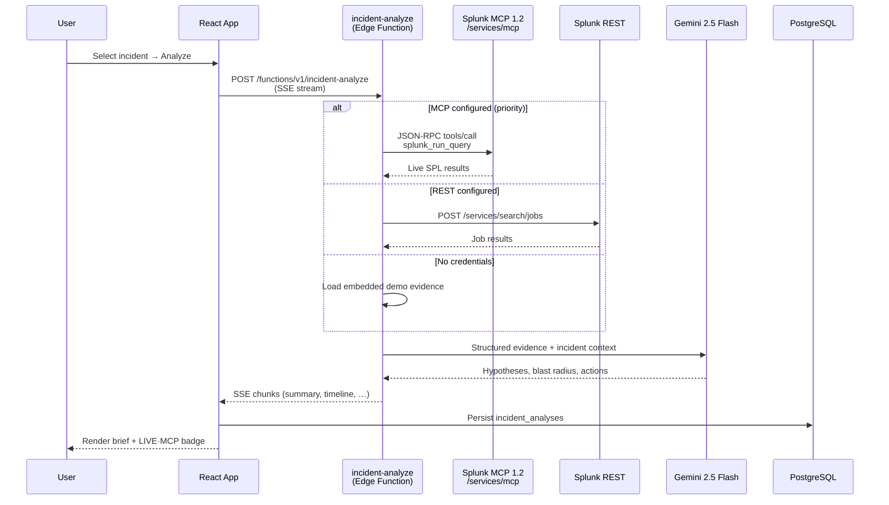
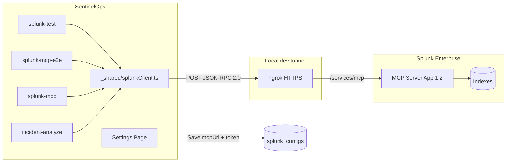
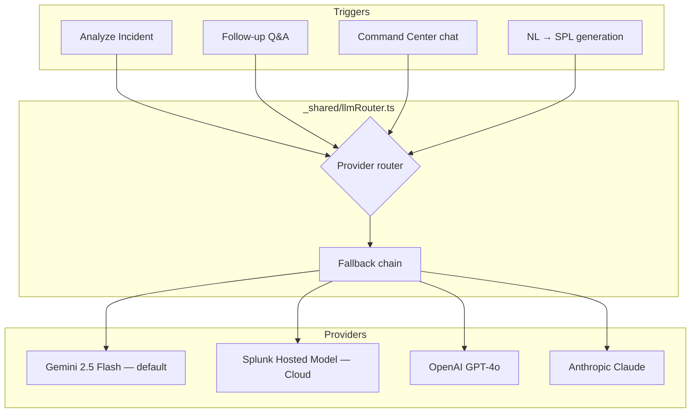
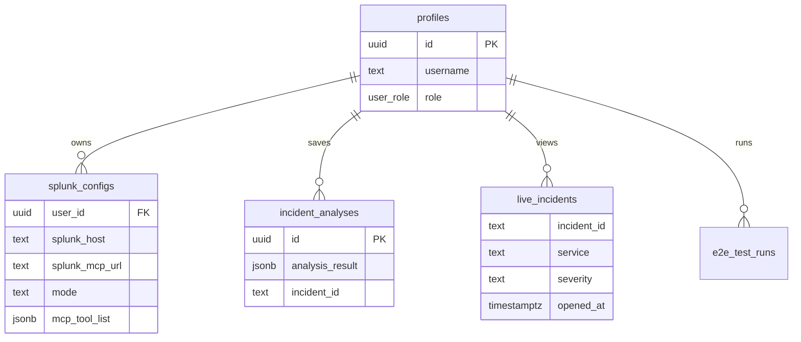
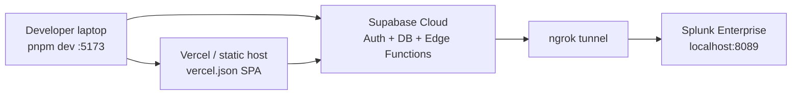

# SentinelOps — Architecture Diagram

> **Splunk Agentic Ops Hackathon 2026 · Observability Track**

SentinelOps is a hybrid **dual-layer** system: **Layer A** gathers evidence from Splunk; **Layer B** runs AI reasoning. Every analysis records `evidenceSource` and `reasoningSource` in the UI and API payload.

---

## High-Level System Overview

---

## Incident Analyze — Data Flow

Primary agentic workflow when a user clicks **Analyze** on an incident.

---

## Splunk MCP Integration (Layer A)

**Protocol details (MCP 1.2):**

| Item | Value |
|------|--------|
| Transport | Streamable HTTP — `POST {base}/services/mcp` |
| Protocol | JSON-RPC 2.0 |
| Primary tool | `splunk_run_query` |
| Fallback tool | `splunk_run_search` |
| Discovery | `initialize` + `tools/list` |
| ngrok | Auto `ngrok-skip-browser-warning: true` header |

---

## AI Reasoning Integration (Layer B)

**Attribution:** UI badges show `GEMINI`, `SPLUNK HOSTED MODEL`, etc. Analysis JSON includes `reasoningSource`.

---

## Edge Functions Map

| Function | Role |
|----------|------|
| `incident-analyze` | Core orchestration — evidence + AI brief (SSE) |
| `incident-followup` | Streaming follow-up chat |
| `splunk-mcp` | MCP relay — NL→SPL, direct tool calls |
| `splunk-test` | REST/MCP connectivity + auth debug |
| `splunk-mcp-e2e` | Health check — tools/list + SPL smoke tests |
| `large-language-model` | Gemini proxy for Command Center |
| `splunk-alerts` / `splunk-search` | Saved alerts + SPL execution |
| `splunk-alert-webhook` | Inbound Splunk alert → `live_incidents` |
| `ai-search` / `web-search` / `web-reader` | Investigation tools |
| `pagerduty-sync` / `slack-alert` / `alert-email` | Alert routing |

---

## Database (key tables)

---

## Deployment Topology

---

## Evidence vs Reasoning — Configuration Modes

| Mode | Evidence badge | Source |
|------|----------------|--------|
| Demo | `DEMO` | Embedded sample incidents (no Splunk) |
| Live REST | `LIVE · REST` | Splunk REST API via ngrok or direct HTTPS |
| Live MCP | `LIVE · MCP` | Splunk MCP Server 1.2 via ngrok or direct HTTPS |

MCP takes priority over REST when both are configured.

---

## Hackathon Submission Notes

- **Track:** Observability — agentic incident commander for on-call / SRE teams
- **Splunk MCP Server:** Full MCP 1.2 compliance — tool discovery, `splunk_run_query`, E2E panel
- **Splunk Hosted Models:** Supported when Splunk Cloud AI endpoint is configured; local Enterprise uses Gemini for reasoning
- **Demo reliability:** Demo mode works without Splunk credentials for judges

---

_SentinelOps · Splunk Agentic Ops Hackathon 2026_
